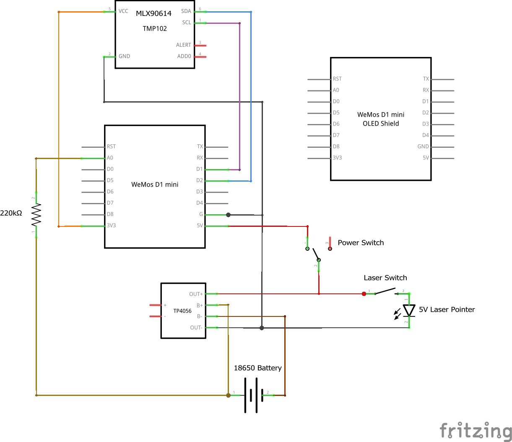

# Infrared Thermometer (aka. Laser Temp Gun)

A battery-powered infrared thermometer with a laser pointer built with an ESP8266 microcontroller and an MLX90614 sensor.

## Features

- Measures ambient and target object temperature with the MLX90614 infrared sensor.
- Shoots a laser beam to mark the target object.
- Powered by a 18650 battery.
- Measures battery level.
- Displays measured data on the Wemos OLED shield.
- Controlled by a Wemos D1 Mini microcontroller board.
- Allows charging the battery via a TP4056 charger.

## On this page

- [Features](#features)
- [On this page](#on-this-page)
- [Getting Started](#getting-started)
  - [Hardware](#hardware)
    - [Bill of Materials](#bill-of-materials)
    - [Wiring](#wiring)
  - [Software](#software)
    - [Prerequisites](#prerequisites)
    - [Setup](#setup)
  - [3D-Printed Case](#3d-printed-case)
- [About the author](#about-the-author)

(This Table of Contents was generated with [nGitHubTOC](https://imthenachoman.github.io/nGitHubTOC/), but [sompylasar's solution](https://github.com/isaacs/github/issues/215#issuecomment-456598835) is also very usable.)

## Getting Started

### Hardware

#### Bill of Materials

You need the following hardware components to build this project:
- Wemos D1 Mini controller board
- Wemos OLED shield
- MLX90614 infrared sensor
- 5V laser pointer
- 18650 battery
- 18650 battery holder
- TP4056 battery charger board
- 220K resistor (to measure the battery level)
- On-off switch
- Momentary push button

#### Wiring

### Software

#### Prerequisites

Install the following libraries in the Arduino IDE:
- Adafruit GFX Library by Adafruit.
- Adafruit SSD1306 Wemos Mini OLED by Adafruit + mcauser
- Adafruit MLX90614 by Adafruit.

#### Setup

Just compile and upload the [./software/InfraredThermometer/InfraredThermometer.ino](./software/InfraredThermometer/InfraredThermometer.ino) file from this repository and you are done! No additional configuration is necessary.

### 3D-Printed Case

Coming soon...

## About the author

This project is maintained by [György Balássy](https://linkedin.com/in/balassy).