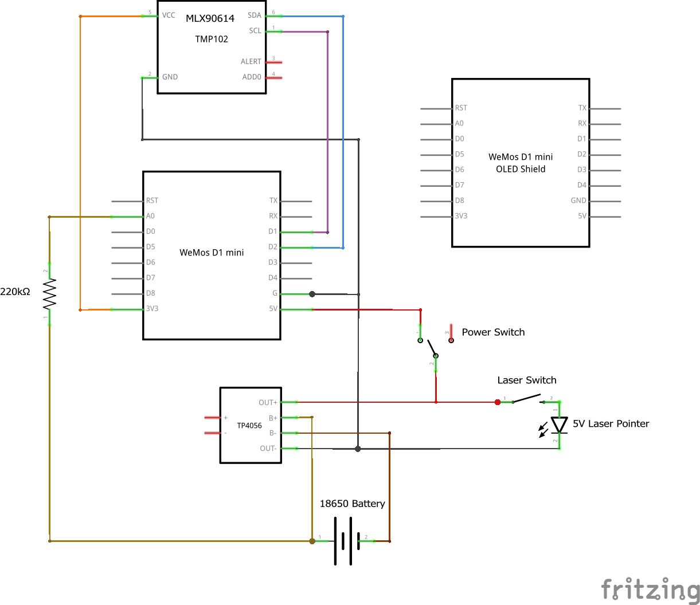
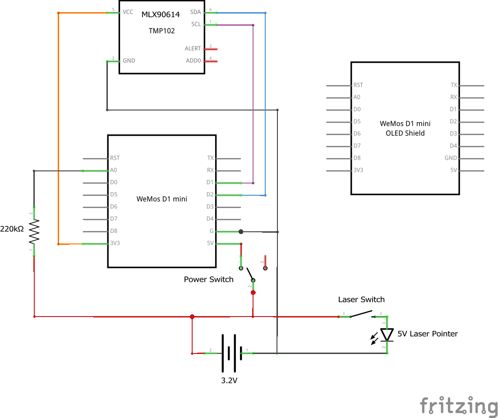
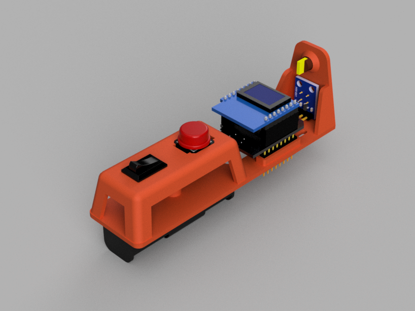

# Infrared Thermometer (aka. Laser Temp Gun)

A battery-powered infrared thermometer with a laser pointer built with an ESP8266 microcontroller and an MLX90614 sensor.

## Features

- Measures ambient and target object temperature with the MLX90614 infrared sensor. 
  - -40 … +125 °C for sensor temperature
  - -70 … +380 °C for object temperature
  - High accuracy of 0.5 °C over wide temperature range (0 … +50 °C for both Ta and To)
  - High (medical) accuracy calibration
  - Measurement resolution of 0.02 °C
- Shoots a laser beam to mark the target object.
- Powered by a 18650 battery (Model A) or a LiFePO4 3.2V AA battery (Model D).
- Measures battery level.
- Displays measured data on the Wemos OLED shield.
- Controlled by a Wemos D1 Mini microcontroller board.
- Allows charging the battery via a TP4056 charger (Model A).

## On this page

- [Features](#features)
- [On this page](#on-this-page)
- [Getting Started](#getting-started)
  - [Hardware](#hardware)
    - [Bill of Materials](#bill-of-materials)
    - [Wiring](#wiring)
  - [Software](#software)
    - [Prerequisites](#prerequisites)
    - [Setup](#setup)
  - [3D-Printed Case](#3d-printed-case)
- [About the author](#about-the-author)

(This Table of Contents was generated with [nGitHubTOC](https://imthenachoman.github.io/nGitHubTOC/), but [sompylasar's solution](https://github.com/isaacs/github/issues/215#issuecomment-456598835) is also very usable.)

## Getting Started

### Hardware

#### Bill of Materials

You need the following hardware components to build this project:
- Wemos D1 Mini controller board
- Wemos OLED shield
- MLX90614 infrared sensor
- 5V laser pointer
- 220K resistor (to measure the battery level)
- On-off switch
- Momentary push button
- For Model A:
  - 18650 battery
  - 18650 battery holder
  - TP4056 battery charger board
- For Model D:
  - LiFePO4 3.2V AA battery
  - Single AA battery holder
  - M3x6 screw to mount the battery holder

#### Wiring

Model A:

Model D:

You can find the Fritzing file in the `./hardware` folder.

### Software

#### Prerequisites

Install the following libraries in the Arduino IDE:
- Adafruit GFX Library by Adafruit.
- Adafruit SSD1306 Wemos Mini OLED by Adafruit + mcauser
- Adafruit MLX90614 by Adafruit.

#### Setup

Just compile and upload the [./software/InfraredThermometer/InfraredThermometer.ino](./software/InfraredThermometer/InfraredThermometer.ino) file from this repository and you are done! No additional configuration is necessary.

### 3D-Printed Case

I designed a 3D printable case only for Model D. It's more a part-holder bone than a full housing, but still it is functional and I find it cool that it reveals how the device is working.

You can find the 3D printable STL and all the source files in the `./case` folder. 

You can print with 0.2mm layer height without support. The holes for the buttons and the battery holder mounting screw is covered with a sacrificial layer to avoid supports, so you must remove that after printing.

## About the author

This project is maintained by [György Balássy](https://linkedin.com/in/balassy).